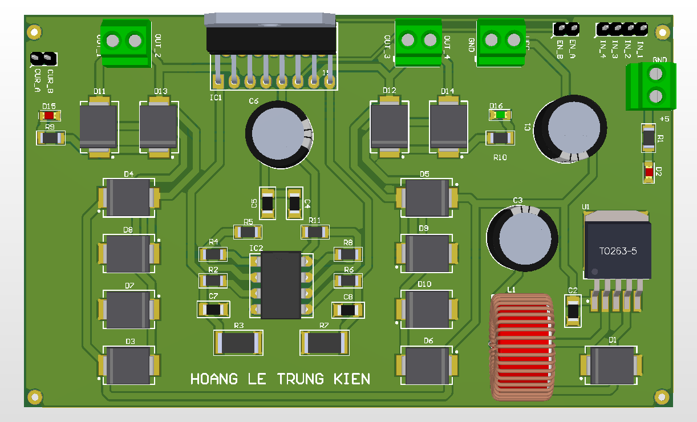

# L298N Advanced Motor Driver

Dual H-Bridge motor driver with monitoring.

## Function
Controls DC motors or stepper motors.

## Key Specifications
- Driver: L298N
- Buck: LM2596S-5.0
- Sensing: LM358
- Protection: SS54 diodes

## Hardware Preview

---
Designed by HOANG LE TRUNG KIEN
